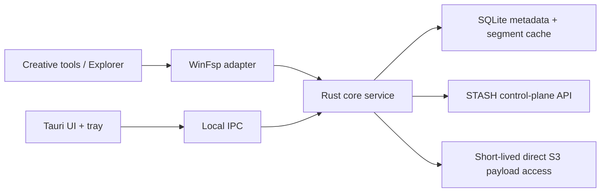

# Architecture Spine — STASH Windows creative-drive client

## Design Paradigm

**Hexagonal core service with an OS-adapter boundary.** Rust owns domain state
and I/O. WinFsp is the Windows filesystem adapter. Tauri is a separate UI
adapter over local IPC; it never handles filesystem callbacks.



## Invariants & Rules

### AD-1 — Rust core service and Tauri shell [ADOPTED]

- **Binds:** all desktop-client capabilities.
- **Prevents:** UI lifetime, rendering errors, or WebView behavior taking down
  filesystem I/O and transfer recovery.
- **Rule:** one background Rust service owns filesystem operations, sync,
  transfer state, cache, auth-session use, local search, and recovery. Tauri
  is only its local user interface and tray surface.

### AD-2 — WinFsp adapter and GPLv3 compatibility [ADOPTED]

- **Binds:** Windows mount, installer, source distribution.
- **Prevents:** a proprietary distribution accidentally embedding a GPLv3
  dependency without meeting its obligations.
- **Rule:** use the `winfsp` Rust crate with WinFsp for Windows. STASH desktop
  distribution is open source and GPLv3-compatible; preserve notices and
  validate release obligations before distributing binaries.

### AD-3 — Creative-tool filesystem contract [ADOPTED]

- **Binds:** file open/read/seek, enumeration, cache, retry, offline behavior.
- **Prevents:** an app-shaped fake drive that works in STASH but stalls or
  misbehaves in DAWs, editors, image tools, or 3D tools.
- **Rule:** every cloud-only open supports byte-range reads and seeks, uses
  local metadata for directory enumeration/stat, applies bounded timeouts and
  cancellation, and never blocks a caller indefinitely on a remote request.

### AD-4 — Core is the only local state writer

- **Binds:** cache, transfer queue, metadata mirror, search index, Tauri IPC.
- **Prevents:** UI and filesystem adapters independently mutating local state
  and creating unrecoverable cache or sync divergence.
- **Rule:** the Rust core serializes durable state transitions. Adapters submit
  commands and consume snapshots/events; neither writes SQLite or cache
  metadata directly.

### AD-5 — Payload access is short-lived and range-capable

- **Binds:** download authorization, WinFsp reads, S3 adapter, security.
- **Prevents:** permanent AWS credentials on the client, whole-file downloads
  for a seek, and accidental logging/persistence of payload leases.
- **Rule:** the control plane authorizes caller-owned `fileId` reads; the core
  holds any resulting short-lived S3 lease only in memory and performs direct
  range requests. Object keys and presigned URLs never enter logs, SQLite, or
  the Tauri frontend.

### AD-6 — Cache is segment-aware and recovery-safe

- **Binds:** read-ahead, pinned content, LRU eviction, restart recovery.
- **Prevents:** a partial or evicted download being presented as a complete
  local file, or an LRU evicting pinned creator assets.
- **Rule:** cache records distinguish missing, partial, verified, pinned, and
  evictable content. Reads may serve only verified ranges; pinned content is
  excluded from automatic eviction; interrupted work is resumable after a
  service or machine restart.

### AD-7 — Feasibility precedes feature breadth

- **Binds:** beta implementation sequencing and acceptance.
- **Prevents:** building the full dashboard before proving the product's
  defining Windows filesystem behavior.
- **Rule:** implement and measure the mount spike before the full UI. It must
  mount `STASH (S:)`, list a large metadata-backed folder, open/seek a
  cloud-only asset through a real creative tool, and return a bounded failure
  after simulated network loss.

## Consistency Conventions

| Concern | Convention |
| --- | --- |
| Identity | Verified Cognito subject is the only user identity; local installation ID identifies a device, never a user. |
| Time | UTC ISO-8601 in persisted/event data; monotonic timing for in-process timeout measurement. |
| Filesystem state | `cloud`, `available`, `pinned`, `stashing`, `syncing`, `issue`; never claim `available` for incomplete cache data. |
| Errors | OS adapter maps bounded core failures to filesystem errors; UI gets structured, actionable events without secrets. |
| Security | No AWS credentials in the app; tokens, object keys, and S3 leases are never logged. |

## Stack

| Name | Version |
| --- | --- |
| Rust | 1.98.1 stable |
| Tauri | 2.11.2 line |
| Windows filesystem adapter | `winfsp` 0.13.1 + WinFsp 2.1 |
| Local database | SQLite — version pinned when the spike creates its lockfile |

## Structural Seed

```text
desktop/
  crates/
    stash-core/          # domain, sync, cache, search, transfer orchestration
    stash-windows-fs/    # WinFsp adapter; no Tauri dependency
    stash-s3/            # short-lived direct payload reads/writes
    stash-ipc/           # command/event boundary for adapters
  apps/
    stash-desktop/       # Tauri shell, tray, Windows packaging
  tests/
    mount-spike/         # real Explorer and creative-tool compatibility tests
```

## Capability → Architecture Map

| Capability / Area | Lives in | Governed by |
| --- | --- | --- |
| Mounted `STASH (S:)` | `stash-windows-fs` + `stash-core` | AD-1, AD-2, AD-3 |
| Browse and large enumeration | local metadata mirror | AD-3, AD-4 |
| Cloud-only open / seek | `stash-s3` + segment cache | AD-3, AD-5, AD-6 |
| Stash, resume, and recovery | transfer orchestration | AD-1, AD-4, AD-6 |
| Home, Transfers, Settings, tray | Tauri shell | AD-1, UX spines |
| Direct S3 authorization | existing API plus new read authorization | AD-5 |

## Deferred

- **macOS adapter:** choose File Provider versus FUSE only after the Windows
  spike; Apple File Provider is the preferred native exploration path.
- **Download authorization API shape:** required before payload reads; define
  in a dedicated backend/API contract task so it preserves caller scoping and
  range semantics.
- **SQLite/search library, cache segment size, read-ahead policy, and latency
  budgets:** measure during the mount spike; do not guess from UI needs.
- **Full browser companion:** intentionally post-beta.
